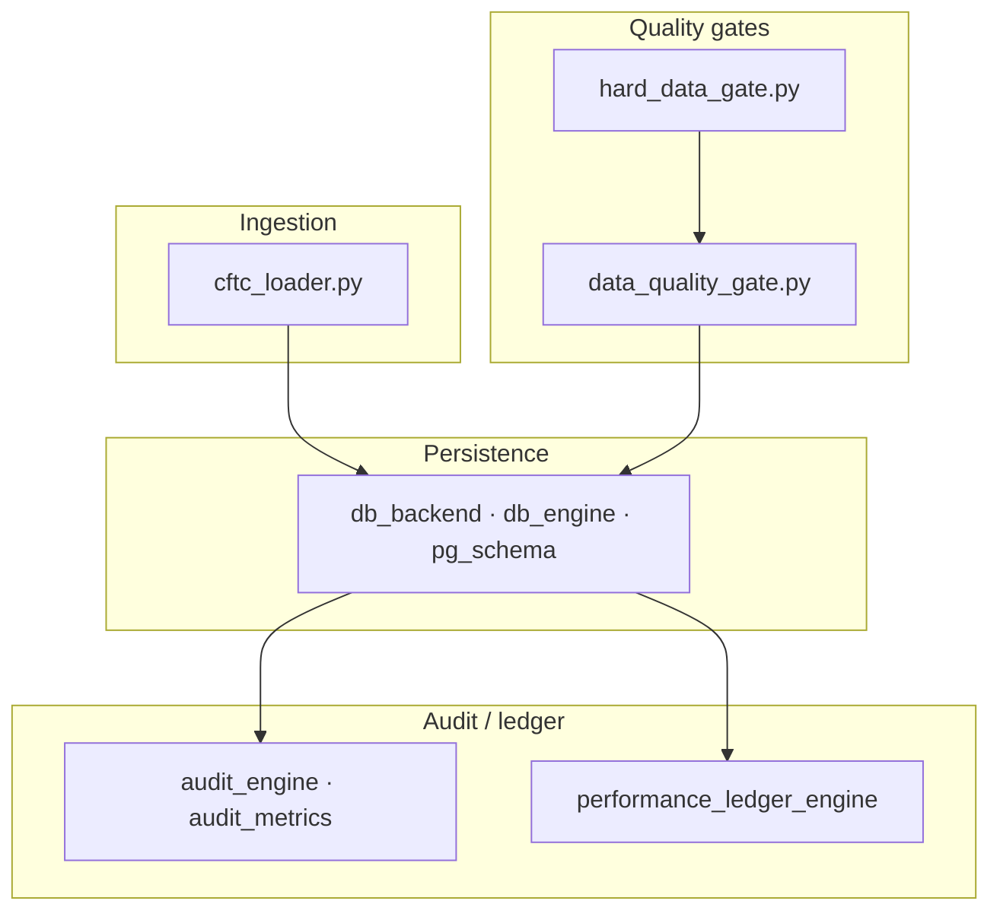

# KDS Quant — public showcase

[](#)
[](#)
[](#)
[](#)
[](#)

This repository is a **curated subset** of the KDS Quant stack: documentation, CI, **database and data-quality infrastructure**, CFTC ingest, and representative tests. It demonstrates how resilient data pipelines, dual SQLite/Postgres backends, **data integrity gates**, **persistence**, and **audit / ledger** plumbing are structured—**without** shipping proprietary scoring, shock, or notify modules. This tree is intentionally **headless**: there is no bundled web UI here.

Read **[SHOWCASE.md](SHOWCASE.md)** first (scope, what was added for import closure, test notes).

---

## Quick start

1. **Python 3.11+** — `python -m venv .venv`, activate, then `pip install -r requirements.txt`.
2. **Configuration (optional)** — for local DB path overrides, use environment variables as documented in `engine/config.py` and **[SECURITY.md](SECURITY.md)**. The `.streamlit/secrets.example.toml` file remains only as a **legacy template** for engineers who still mirror DSN patterns from the full monorepo; do not commit real secrets.
3. **Tests** — `pytest tests/` (~30 tests, infrastructure focus).

Licensing: **[LICENSE](LICENSE)** (MIT). Security: **[SECURITY.md](SECURITY.md)**. Contributions: **[CONTRIBUTING.md](CONTRIBUTING.md)**.

---

## UI / Frontend

The legacy Streamlit UI has been **decommissioned** from this showcase. A professional **Next.js SaaS terminal** is currently under development (private repository) to interface with this engine. This public tree exposes **engine logic, gates, persistence, and audit** only.

---

## What is in this tree (Headless Quant Engine)

| Area | Role |
|------|------|
| **`engine/`** | DB backend, SQLite/Postgres schema helpers, retry HTTP, **data quality** and **hard data** gates, audit + performance ledger utilities, `config`, CFTC constants, Yahoo single-history helper. |
| **`cftc_loader.py`** | Example CFTC zip → filtered frames → DB paths used in the full product. |
| **`scripts/migrate_sqlite_to_supabase.py`** | One-shot SQLite → Supabase table copy (requires `DATABASE_URL`). |
| **`docs/`** | Supabase setup and architecture diagrams. |
| **`tests/`** | Contract tests for gates, retry, DSN resolution, DB bootstrap, audit/ledger helpers. |
| **`.github/workflows/`** | **`ci.yml`** runs pytest + coverage on push/PR. Other YAML files are **reference placeholders** (same names as production) so scheduled jobs do not call missing entrypoints; see comments inside each file. |

---

## Architecture (this slice only)



For the **full** system narrative (with modules not vendored here), see **[QUANT_SYSTEM_BLUEPRINT.md](QUANT_SYSTEM_BLUEPRINT.md)** — numeric strategy parameters in §2–§4 are redacted as `[PARAM]` in this public copy.

---

## Supabase (hosted PostgreSQL)

| Topic | Detail |
|--------|--------|
| **Activation** | Set `DATABASE_URL` (or `SUPABASE_DB_URL` / `SUPABASE_POSTGRES_URL`) in the environment. Otherwise SQLite via `get_sqlite_db_path()`. |
| **Connection string** | Prefer **transaction pooler** port **6543** (`*.pooler.supabase.com`). |
| **Migration** | `scripts/migrate_sqlite_to_supabase.py` — details in **[docs/SUPABASE_SETUP.md](docs/SUPABASE_SETUP.md)**. |

---

## Repository layout

```text
.
├── LICENSE
├── README.md
├── SHOWCASE.md
├── SECURITY.md
├── CONTRIBUTING.md
├── QUANT_SYSTEM_BLUEPRINT.md
├── pytest.ini
├── requirements.txt
├── .gitignore
├── cftc_loader.py
├── cot_quant_master.db         # Seed DB for bootstrap test (~5 MB)
├── .streamlit/
│   └── secrets.example.toml    # Legacy DSN template only (see SECURITY.md)
├── docs/
│   ├── SUPABASE_SETUP.md
│   ├── master_logic_data_flow.mmd
│   └── master_logic_data_flow.png
├── engine/
│   ├── __init__.py
│   ├── audit_engine.py
│   ├── audit_metrics.py
│   ├── config.py
│   ├── cot_cftc_constants.py
│   ├── data_quality_gate.py
│   ├── db_backend.py
│   ├── db_engine.py
│   ├── hard_data_gate.py
│   ├── performance_ledger_engine.py
│   ├── pg_schema.py
│   ├── retry_http.py
│   ├── retry_util.py
│   └── yahoo_single_history.py
├── scripts/
│   └── migrate_sqlite_to_supabase.py
├── tests/
│   ├── conftest.py
│   └── test_*.py
└── .github/workflows/
    ├── ci.yml
    ├── heartbeat.yml
    ├── perf-backfill-artifact.yml
    ├── quant-notify-daily-top5.yml
    ├── quant-notify-saturday-cot.yml
    └── quant-notify-watch-3h.yml
```

---

## CI

On push/PR, **`ci.yml`** installs dependencies, strips any committed `.streamlit/secrets.toml`, runs `pytest tests/` with `engine` coverage (**fail-under 30%** for this reduced tree).

---

*Kresic Digital Systems — engineering showcase.*
